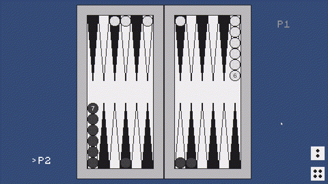
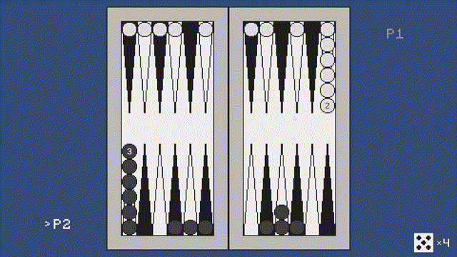

# Backgammon / Нарды

[English](#eng) | [Українська](#ukr) | [Русский](#rus)

---

## English

**Backgammon** is a backgammon game developed using the Unity engine for desktop.

---

### Match Start
Upon launch, the game initializes the board and prepares the checkers for the first move.

  

---

### Controls and Gameplay
Interaction is handled via mouse clicks. The system highlights available moves and blocks illegal actions.

- **Select Checker:** Click the mouse on a slot.
- **Move:** Click the mouse on a highlighted slot.
- **Cancel Selection:** Press the Escape key.

  

---

### Double Mechanic
When rolling doubles, the player is granted four moves instead of two.

  

---

### Available Modes and Formats
- **Game Modes:** Long Backgammon.
- **Play Style:** Local.

---

## Українська

**Backgammon** — гра в нарди, розроблена на рушії Unity для десктопа.

---

### Початок матчу
При запуску гра ініціалізує поле та готує фішки до першого ходу.

  

---

### Керування та ігровий процес
Взаємодія здійснюється за допомогою миші. Система підсвічує доступні кроки та блокує неможливі ходи.

- **Вибір шашки:** Клік мишкою по слоту.
- **Хід:** Клік мишкою по підсвіченому слоту.
- **Скасування вибору:** Клавіша Escape.

  

---

### Механіка дубля
При випаданні однакових значень на костях, гравець отримує право зробити чотири ходи замість двох.

  

---

### Доступні режими та формати гри
- **Режими нард:** Довгі нарди.
- **Способи гри:** Локально.

---

## Русский

**Backgammon** - игра в нарды, разработанная на движке Unity для десктопа.

---

### Начало матча
При запуске игра инициализирует поле и подготавливает фишки к первому ходу.

  

---

### Управление и игровой процесс
Взаимодействие осуществляется с помощью мыши. Система подсвечивает доступные шаги и блокирует невозможные ходы.

- **Выбор шашки:** Клик мышкой по слоту.
- **Ход:** Клик мышкой по подсвеченному слоту.
- **Отмена выбора:** Клавиша Escape.

  

---

### Механика дубля
При выпадении одинаковых значений на костях, игрок получает право совершить четыре хода вместо двух.

  

---

### Доступные режимы и форматы игры
- **Режимы нард:** Длинные нарды.
- **Способы игры:** Локально.
